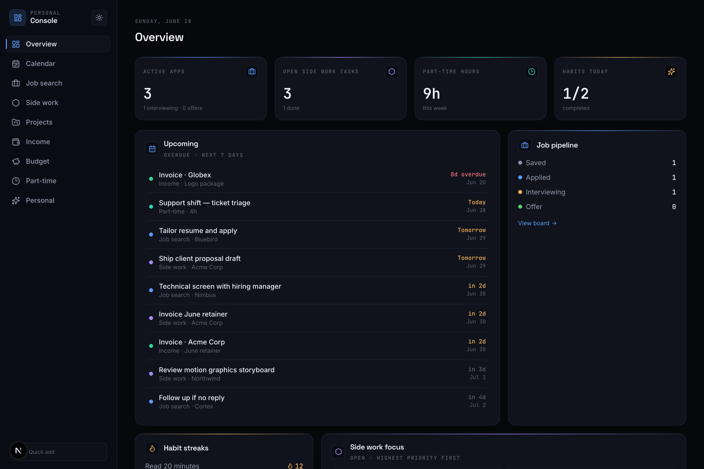
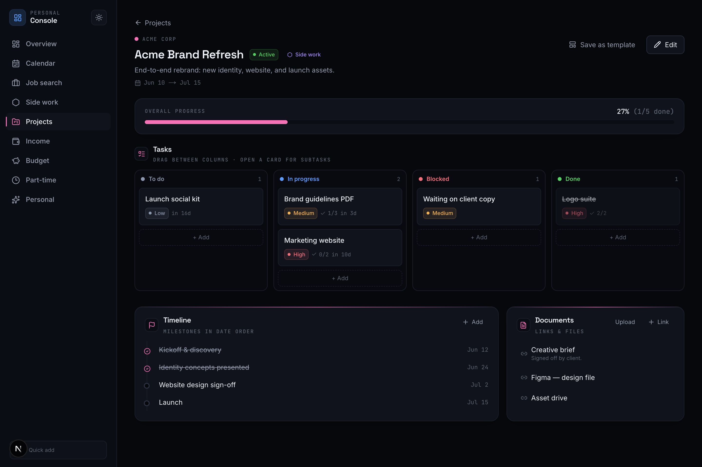
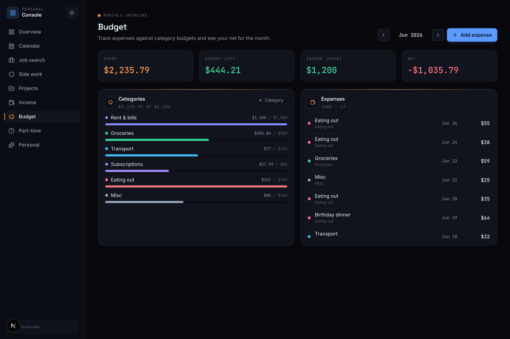
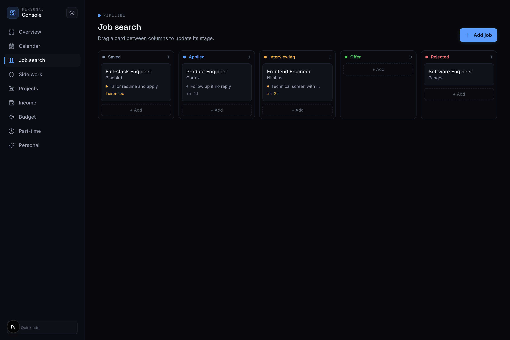
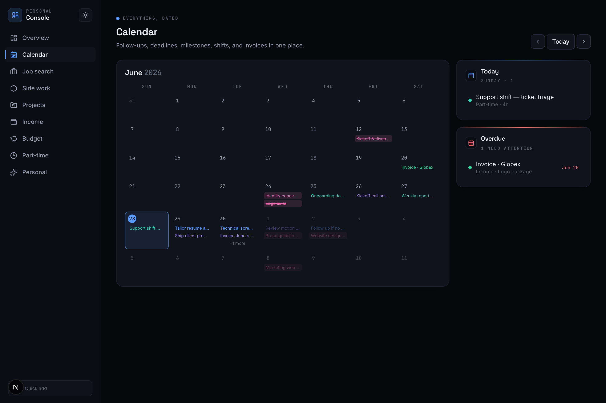
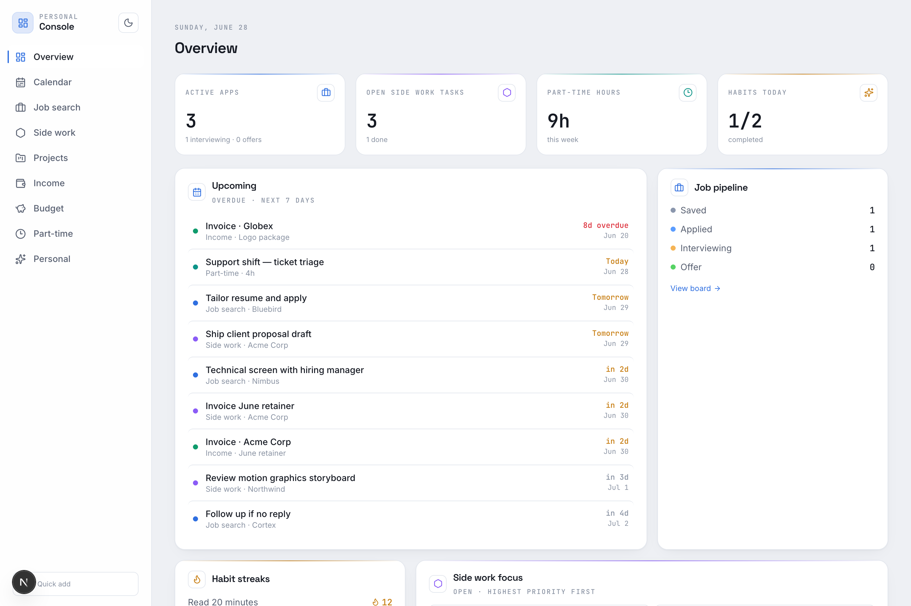

# Console

> A local-first **personal dashboard** for everything you're juggling — job search,
> side work, projects, income, budget, time, and habits — in one calm,
> keyboard-driven console. Your data lives in plain JSON files on your machine. No
> accounts, no backend, no tracking.



Built with **Next.js (App Router) · React · TypeScript · Tailwind CSS v4**. It runs
entirely on your laptop — every record is a JSON file under `data/` that you own and
can back up, edit by hand, or sync however you like.

---

## ✦ Features

- **Overview** — a daily landing page: stat cards per area, a unified "Upcoming" list
  (deadlines, follow-ups, milestones, shifts, and invoices merged across every
  module), job pipeline, habit streaks, and side-work focus.
- **Calendar** — a month view that aggregates *every* dated item, plus a Today /
  Overdue agenda. Event chips on desktop, dots on mobile.
- **Job search** — a kanban pipeline (saved → applied → interviewing → offer →
  rejected) with next-action reminders and due-date coloring.
- **Side work** — a task board (to do / in progress / blocked / done) with priority
  and due dates for your freelance / client work.
- **Projects** — each project is its own workspace: a **Tasks** kanban with subtask
  checklists, a **Timeline** of milestones, and **Documents** (external links *or*
  files uploaded to your laptop). Reusable **project templates** included.
- **Income** — invoices with draft / sent / paid status, automatic overdue
  detection, and outstanding / paid-this-month / paid-this-year totals.
- **Budget** — monthly expenses against category limits with progress bars (red when
  over), plus net cash flow (income − spend).
- **Part-time** — a simple time log with weekly hours.
- **Personal** — habit streaks (with a "done today" toggle) plus goals and to-dos.
- **Quick add** — press **`N`** (or `⌘/Ctrl+K`) anywhere to capture into any module
  without leaving the page.
- **Drag & drop** — move cards between board columns (pointer or full keyboard
  support); changes save optimistically.
- **Light & dark mode** — a sidebar toggle; each theme is its own designed palette,
  not an inversion. Follows your system preference by default, with no flash on load.
- **Control it from Claude** — a bundled **MCP server** lets any Claude session read
  and update the dashboard in plain language (see below).

---

## 📸 Screenshots

|  |  |
| --- | --- |
| **Projects** — tasks, timeline & docs | **Budget** — categories & net |
|  |  |
| **Job search** — kanban pipeline | **Calendar** — everything, dated |
|  |  |

**Light & dark**, designed as separate palettes:

| Dark | Light |
| --- | --- |
|  |  |

---

## 🚀 Quick start

```bash
git clone <your-repo-url> console
cd console
npm install
npm run dev
```

Open **http://localhost:3000**. It ships with neutral sample data so it isn't empty —
clear a module by deleting its file in `data/` (it re-seeds from `data.seed/`) or just
edit/delete records in the UI.

---

## 🤖 Control it from Claude (MCP)

The repo ships an **MCP server** ([`mcp/server.mts`](mcp/server.mts)) so any Claude
session can read and update your dashboard in plain language — *"add a job at Acme",
"create a project from the Brand template", "log a $40 groceries expense", "how's my
budget this month?"*. It writes the same `data/*.json` files, so changes appear on the
next dashboard refresh. No dev server required.

It exposes ~39 tools: `get_overview`, `list/add/update/delete` for jobs, side-work
tasks, part-time, personal, projects, and invoices — plus `add_project_task` (with
subtasks), `add_milestone`, `add_project_link`, `add_invoice`,
`create_project_from_template`, `add_expense`, `get_budget`, and more.

**Claude Code** — already wired up via [`.mcp.json`](.mcp.json). Open the repo in a
Claude Code session, approve the `console` server when prompted, then just ask.

**Claude Desktop** — add this to its MCP config
(`~/Library/Application Support/Claude/claude_desktop_config.json` on macOS), using the
**absolute path** to this folder, then restart Claude Desktop:

```json
{
  "mcpServers": {
    "console": {
      "command": "npx",
      "args": ["tsx", "mcp/server.mts"],
      "cwd": "/absolute/path/to/console"
    }
  }
}
```

Run it standalone to debug with `npm run mcp`.

---

## 🗂 How it's organized

| Path | What's there |
| --- | --- |
| `app/page.tsx` | Overview — aggregates every module |
| `app/calendar/` · `app/jobs/` · `app/sidework/` | Calendar, job pipeline, side-work board |
| `app/projects/` | Projects list + per-project page (`[id]`) and templates |
| `app/income/` · `app/budget/` · `app/part-time/` · `app/personal/` | Money, time & habits |
| `app/api/files/[...path]/` | Serves uploaded files from `data/uploads/` (path-traversal guarded) |
| `lib/store.ts` | File-backed JSON store (read / write / upsert / remove) |
| `lib/types.ts` · `lib/meta.ts` | Data models and shared labels/colors |
| `components/ui/` · `components/widgets/` | UI primitives and reusable pieces |
| `mcp/server.mts` | The MCP server |
| `data/` | Your live data (git-ignored) |
| `data.seed/` | Sample data, copied into `data/` on first run |

### Data & storage

Each module is one JSON array under `data/<module>.json`. On first read a missing file
is seeded from `data.seed/`. Every change goes through a server action that writes the
file atomically, so edits survive restarts. To wipe a module, delete its file (it
re-seeds) or edit it by hand.

### Design

A calm "Console" aesthetic: one accent color per module and a technical type system —
**Space Grotesk** (display), **Inter** (body), **JetBrains Mono** (all data/labels,
tabular figures). Icons are [Lucide](https://lucide.dev) throughout. Theme tokens (both
light and dark) live in [`app/globals.css`](app/globals.css).

---

## 🔧 Configuration

- **Currency** — defaults to `USD`; change `DEFAULT_CURRENCY` in
  [`lib/invoices.ts`](lib/invoices.ts).
- **Modules** — add one by creating `app/<name>/` with a `page.tsx`, `actions.ts`, and
  a client component, plus a type in `lib/types.ts` and a `Collections` entry. The
  overview and calendar read from all collections, so new modules plug right in.
- **Auth** — none. It's local and single-user. To deploy it, add a password gate and
  move storage off local files.

---

## 🧱 Tech

Next.js 16 · React 19 · TypeScript · Tailwind CSS v4 · lucide-react · dnd-kit ·
`@modelcontextprotocol/sdk`.

## License

MIT — add a `LICENSE` file before sharing if you want it explicit.
